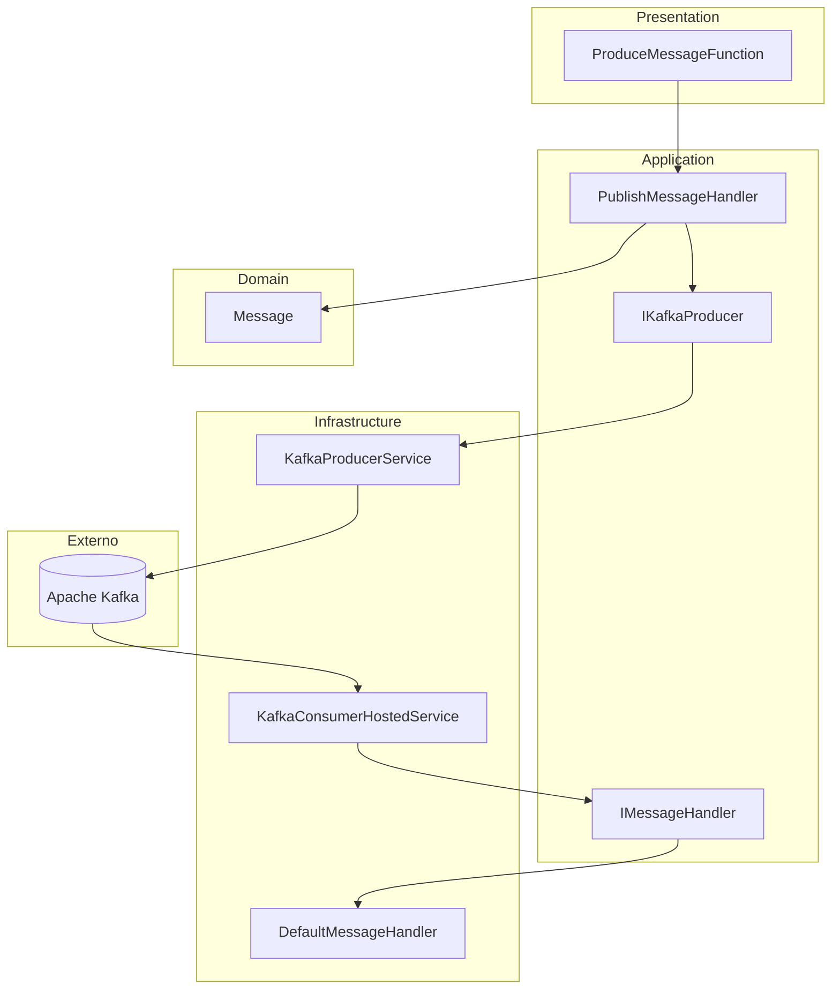

# Producer & Consumer Kafka

Projeto de referência em **.NET 8** que demonstra integração com **Apache Kafka** usando **Clean Architecture**, com produtor exposto via **Azure Functions** e consumidor em background no mesmo host.

Uso de separação de responsabilidades, injeção de dependência, configuração externalizada e mensageria assíncrona.

---

## O que este projeto demonstra

- Arquitetura em camadas (Domain, Application, Infrastructure, Presentation)
- Padrão Ports & Adapters (interfaces na Application, implementação na Infrastructure)
- Produtor e consumidor Kafka com **Confluent.Kafka**
- API HTTP para publicação de mensagens (Azure Functions v4, isolated worker)
- Configuração centralizada via `appsettings.json` / `local.settings.json`
- Ambiente local com **Docker Compose** (Kafka + Azurite)

---

## Stack tecnológica

| Tecnologia | Uso |
|---|---|
| .NET 8 | Runtime e linguagem |
| Azure Functions v4 | Host HTTP / apresentação |
| Confluent.Kafka | Cliente Kafka (produtor e consumidor) |
| Apache Kafka | Broker de mensagens |
| Azurite | Emulador de Azure Storage (dev local) |
| Docker Compose | Orquestração de dependências locais |

---

## Arquitetura



### Estrutura da solution

```
ProdAndConsKafka/
├── ProdAndConsKafka.Domain/           # Entidades de domínio
├── ProdAndConsKafka.Application/      # Casos de uso, DTOs e interfaces
├── ProdAndConsKafka.Infrastructure/   # Kafka, configuração e handlers
├── ProdAndConsKafka/                  # Azure Functions (HTTP API)
└── docker-compose.yml                 # Kafka + Azurite
```

### Fluxo da mensagem

1. Cliente envia `POST /api/messages` com o conteúdo da mensagem
2. `PublishMessageHandler` valida e monta a entidade `Message`
3. `KafkaProducerService` publica no tópico configurado
4. `KafkaConsumerHostedService` consome em background e delega ao `DefaultMessageHandler`
5. A mensagem recebida é exibida no console (fins didáticos)

---

## Pré-requisitos

- [.NET 8 SDK](https://dotnet.microsoft.com/download/dotnet/8.0)
- [Docker Desktop](https://www.docker.com/products/docker-desktop/) (para Kafka e Azurite)
- [Azure Functions Core Tools](https://learn.microsoft.com/azure/azure-functions/functions-run-local) **ou** Visual Studio 2022

---

## Como executar

### 1. Subir dependências (Kafka + Azurite)

```bash
cd ProdAndConsKafka
docker compose up -d
```

### 2. Configurar ambiente local

Na pasta `ProdAndConsKafka/ProdAndConsKafka`, crie o arquivo `local.settings.json` (não versionado) com base no exemplo abaixo:

```json
{
  "IsEncrypted": false,
  "Values": {
    "AzureWebJobsStorage": "DefaultEndpointsProtocol=http;AccountName=devstoreaccount1;AccountKey=Eby8vdM02xNOcqFlqUwJPLlmEtlCDXJ1OUz4tSDvH/v8avARld6NRxriL6kinYTMj1IF/KYVDvTQdviHmIj9uBQ==;BlobEndpoint=http://127.0.0.1:10000/devstoreaccount1;QueueEndpoint=http://127.0.0.1:10001/devstoreaccount1;TableEndpoint=http://127.0.0.1:10002/devstoreaccount1;",
    "FUNCTIONS_WORKER_RUNTIME": "dotnet-isolated"
  },
  "Kafka": {
    "Enabled": true,
    "BootstrapServers": "localhost:9092",
    "Topic": "messages",
    "ConsumerGroupId": "prod-cons-group",
    "AutoOffsetReset": "Earliest",
    "SessionTimeoutMs": 6000,
    "ConsumerRetryDelaySeconds": 10
  }
}
```

### 3. Executar a aplicação

**Opção A — Visual Studio:** abra `ProdAndConsKafka.sln` e pressione F5.

**Opção B — CLI:**

```bash
cd ProdAndConsKafka/ProdAndConsKafka
func start
```

A API sobe em `http://localhost:7043` (porta configurada em `launchSettings.json`).

### 4. Publicar uma mensagem

```bash
curl -X POST http://localhost:7043/api/messages \
  -H "Content-Type: application/json" \
  -d "{\"content\": \"Hello Kafka\"}"
```

**Resposta esperada (200 OK):**

```json
{
  "messageId": "3fa85f64-5717-4562-b3fc-2c963f66afa6",
  "success": true
}
```

No console da aplicação, o consumidor exibirá a mensagem recebida:

```
========================================
  MENSAGEM RECEBIDA DO KAFKA
  Id:      3fa85f64-5717-4562-b3fc-2c963f66afa6
  Conteúdo: Hello Kafka
  Data:    2026-06-26 21:15:30 UTC
========================================
```

---

## API

### `POST /api/messages`

Publica uma mensagem no tópico Kafka configurado.

**Request body:**

```json
{
  "content": "Sua mensagem aqui"
}
```

| Campo | Tipo | Obrigatório | Descrição |
|---|---|---|---|
| `content` | string | Sim | Conteúdo da mensagem |

**Respostas:**

| Status | Descrição |
|---|---|
| `200` | Mensagem publicada com sucesso |
| `400` | Body inválido ou `content` ausente |
| `500` | Falha ao publicar (ex.: Kafka indisponível) |

---

## Configuração Kafka

As opções ficam na seção `Kafka` de `appsettings.json` ou `local.settings.json`:

| Propriedade | Padrão | Descrição |
|---|---|---|
| `Enabled` | `true` | Habilita o consumidor em background |
| `BootstrapServers` | `localhost:9092` | Endereço do broker Kafka |
| `Topic` | `messages` | Tópico de publicação/consumo |
| `ConsumerGroupId` | `prod-cons-group` | Grupo do consumidor |
| `AutoOffsetReset` | `Earliest` | Comportamento quando não há offset |
| `SessionTimeoutMs` | `6000` | Timeout de sessão do consumidor |
| `ConsumerRetryDelaySeconds` | `10` | Intervalo de retry se o broker cair |

Para testar apenas a API sem o consumidor, defina `"Enabled": false`.

---

## Decisões de design

- **Clean Architecture** — o domínio não depende de frameworks; Kafka e Azure ficam na Infrastructure
- **Azure Functions como Presentation** — expõe a API sem acoplar regras de negócio ao host
- **BackgroundService para o consumidor** — processamento contínuo no mesmo processo, com retry configurável
- **DTOs na Application** — contrato da API separado da entidade de domínio
- **Docker Compose** — onboarding rápido para quem clona o repositório

---

## Licença

Projeto open source para fins de portfólio e estudo.
